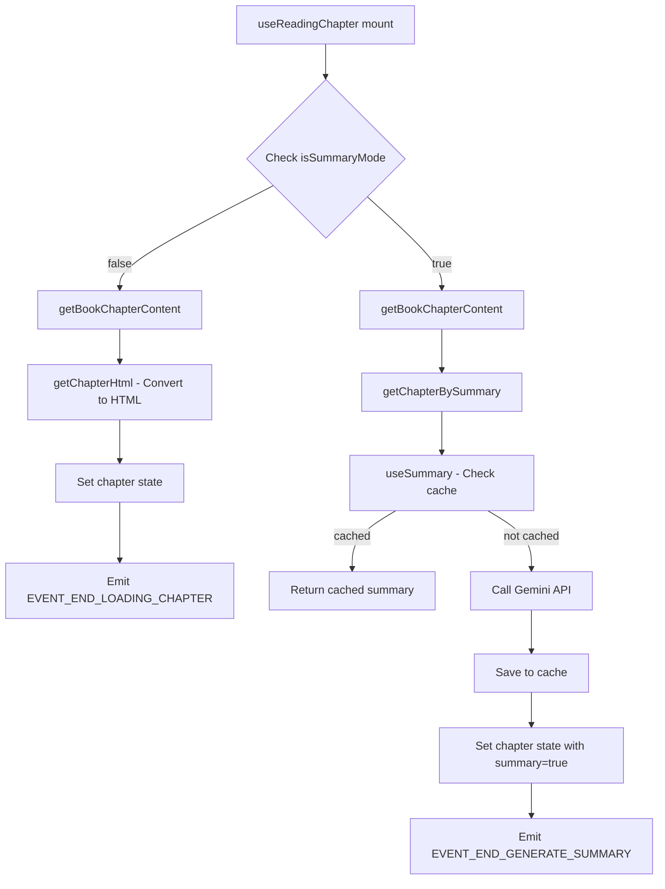

# Hệ Thống Gemini AI Summarization & TTS Integration

## 📋 Tổng Quan

Hệ thống tự động tóm tắt nội dung chương truyện bằng Gemini AI và chuyển đổi sang audio TTS, được tích hợp sâu vào màn hình đọc truyện. Hệ thống hoạt động theo 2 mode:

1. **Đọc thường (Normal Mode)**: Hiển thị nội dung gốc HTML
2. **Đọc tóm tắt (Summary Mode)**: Tự động tóm tắt + phát audio TTS

---

## 🏗️ Kiến Trúc Tổng Thể

```
┌─────────────────────────────────────────────────────────────┐
│                    Reading Screen (/app/reading/index.tsx)  │
│  ┌─────────────────────────────────────────────────────┐    │
│  │  useReadingChapter(bookId)                          │    │
│  │  - Quản lý state chapter hiện tại                   │    │
│  │  - Phát hiện mode (Normal vs Summary)               │    │
│  │  - Điều phối quá trình load/summary                 │    │
│  └──────────────────┬──────────────────────────────────┘    │
│                     │                                        │
│         ┌───────────┴──────────┐                            │
│         ▼                      ▼                            │
│  ┌─────────────┐      ┌──────────────────┐                 │
│  │ Normal Mode │      │  Summary Mode    │                 │
│  │ Load HTML   │      │  useSummary()    │                 │
│  │ Show Raw    │      │  ├─ Check Cache  │                 │
│  │ Content     │      │  ├─ Call Gemini  │                 │
│  │             │      │  └─ Save Cache   │                 │
│  └─────────────┘      └────────┬─────────┘                 │
│                                 │                            │
│                                 ▼                            │
│                    ┌─────────────────────────┐              │
│                    │ ReadingAudioControl     │              │
│                    │ useTtsAudio()           │              │
│                    │ - Split summary         │              │
│                    │ - Call Capcut TTS API   │              │
│                    │ - Queue tracks          │              │
│                    │ - Auto-play             │              │
│                    └─────────────────────────┘              │
└─────────────────────────────────────────────────────────────┘
```

---

## 📦 Các Component Chính

### 1. **Reading Screen** (`/app/reading/index.tsx`)

**Vai trò**: Màn hình đọc chính, kết nối tất cả các module

**Flow hoạt động**:
```typescript
1. Mount component
2. useReadingChapter(bookId) → Load chapter content
3. Kiểm tra isSummaryMode từ store
   - False: Hiển thị HTML gốc
   - True: Gọi useSummary() → Hiển thị tóm tắt
4. Nếu có summary: Render ReadingAudioControl → TTS audio
```

**Các hooks được sử dụng**:
- `useReadingChapter`: Quản lý nội dung chapter
- `useReadingController`: Điều khiển next/previous chapter
- `useReupdateReading`: Đồng bộ reading state

**Event System**:
```typescript
EVENT_START_LOADING_CHAPTER   // Bắt đầu load chapter → Show spinner
EVENT_END_LOADING_CHAPTER     // Hoàn tất load → Hide spinner
EVENT_START_GENERATE_SUMMARY  // Bắt đầu tóm tắt → Show "Đang tóm tắt..."
EVENT_END_GENERATE_SUMMARY    // Hoàn tất tóm tắt → Hide spinner
EVENT_ERROR_GENERATE_SUMMARY  // Lỗi khi tóm tắt → Toast error
READING_NEXT_CHAPTER_DONE     // Đã next chapter → Scroll to top
```

---

### 2. **useReadingChapter Hook** (`/hooks/use-reading-chapter.ts`)

**Vai trò**: Quản lý việc load và xử lý nội dung chapter

**State Management**:
```typescript
interface ChapterState {
  content: string      // HTML content hoặc summary text
  summary: boolean     // Flag: đây có phải summary không?
  index: number        // Số thứ tự chapter
  name: string         // Tên chapter
  bookId: string       // ID của book
}
```

**Logic Flow**:



**Dependencies**:
- `book`: Thông tin book từ store
- `chapterNumber`: Chapter đang đọc từ store
- `isSummaryMode`: Toggle giữa normal/summary mode

**Lưu ý quan trọng**:
```typescript
// useEffect sẽ trigger lại khi:
// - book thay đổi
// - chapterNumber thay đổi
// - isSummaryMode toggle
// ⚠️ Điều này có thể gây re-render không cần thiết nếu user toggle mode liên tục
```

---

### 3. **useSummary Hook** (`/hooks/use-summary.ts`)

**Vai trò**: Xử lý việc tóm tắt nội dung bằng Gemini AI

**Flow hoạt động**:

```typescript
startSummary(bookId, chapterNumber, chapterContent)
  ↓
  1. Check cache: getCachedSummary(bookId, chapterNumber)
     ├─ Có cache → Return ngay lập tức
     └─ Không có → Tiếp tục bước 2
  ↓
  2. Call Gemini API: summarizeChapter(chapterContent)
     ├─ Gửi request đến Gemini
     ├─ Nhận summary text
     └─ Error handling với Alert
  ↓
  3. Save cache: setCachedSummary(bookId, chapterNumber, summary)
  ↓
  4. Return summary
```

**Cache Strategy**:
- **Storage**: MMKV với encryption key `'chapter-summaries'`
- **Key format**: `summary_{bookId}_{chapterNumber}`
- **Benefit**: Giảm số lần gọi API, tiết kiệm chi phí, tăng tốc độ

**Error Handling**:
```typescript
try {
  // Summarize logic
} catch (error) {
  console.error('📝 [Summary Cache] Error summarizing:', error)
  Alert.alert(
    'Lỗi tóm tắt',
    error instanceof Error ? error.message : 'Có lỗi xảy ra khi tóm tắt chương truyện'
  )
}
```

---

### 4. **Gemini Service** (`/services/gemini-service.ts`)

**API Configuration**:
```typescript
// Dynamic model selection từ settings
const getGeminiModel = () => {
  return MMKVStorage.get(MMKVKeys.GEMINI_MODEL) || 'gemini-2.0-flash-exp'
}

// API URL
const getGeminiApiUrl = () => {
  const apiKey = MMKVStorage.get(MMKVKeys.GEMINI_API_KEY)
  const model = getGeminiModel()
  return `https://generativelanguage.googleapis.com/v1beta/models/${model}:generateContent?key=${apiKey}`
}
```

**Summarization Logic**:
```typescript
export const summarizeChapter = async (chapterContent: string): Promise<string> => {
  // 1. Get API key & prompt từ settings
  const apiKey = MMKVStorage.get(MMKVKeys.GEMINI_API_KEY)
  const summaryPrompt = MMKVStorage.get(MMKVKeys.GEMINI_SUMMARY_PROMPT)
  
  // 2. Validate inputs
  if (!apiKey) throw new Error('Thiếu Gemini API Key')
  if (!chapterContent) throw new Error('Nội dung chương trống')
  
  // 3. Build request body
  const requestBody = {
    contents: [{
      parts: [{
        text: `${summaryPrompt}\n\nNội dung chương:\n${chapterContent}`
      }]
    }]
  }
  
  // 4. Call API
  const response = await fetch(getGeminiApiUrl(), {
    method: 'POST',
    headers: { 'Content-Type': 'application/json' },
    body: JSON.stringify(requestBody)
  })
  
  // 5. Parse response
  const data = await response.json()
  return data.candidates[0].content.parts[0].text
}
```

**Settings Dependencies**:
- `GEMINI_API_KEY`: API key từ Google AI Studio
- `GEMINI_MODEL`: Model name (default: `gemini-2.0-flash-exp`)
- `GEMINI_SUMMARY_PROMPT`: Custom prompt để điều chỉnh cách tóm tắt

---

### 5. **ReadingAudioControl** (`/components/reading/reading-audio-control.tsx`)

**Vai trò**: Tự động tạo và phát audio TTS từ summary

**Props**:
```typescript
interface Props {
  chapter: number      // Số chapter
  bookId: string       // ID book
  content: string      // Nội dung summary (HTML đã được xử lý)
}
```

**Lifecycle**:
```typescript
useEffect(() => {
  // On mount hoặc khi chapter/content thay đổi
  startGenerateAudio(content, bookId, chapter)
  
  return () => {
    // Cleanup: Stop TTS khi unmount
    stopGenerateAudio()
  }
}, [chapter, bookId, content])
```

**Render**:
```tsx
<View style={styles.viewContainer}>
  <PlayAudioControl />  {/* UI controls: play/pause/next/prev */}
</View>
```

**Position**: Fixed ở bottom-left màn hình, có safe area insets

---

### 6. **useTtsAudio Hook** (`/hooks/use-tts-audio.ts`)

**Vai trò**: Xử lý toàn bộ logic TTS - chia text, gọi API, queue tracks

**Main Functions**:

#### 6.1 **startGenerateAudio**
```typescript
const startGenerateAudio = async (content: string, bookId: string, chapter: number) => {
  try {
    // 1. Tiền xử lý content
    const cleanContent = content
      .replace(/<[^><]*>/g, ' ')  // Remove HTML tags
      .replace(/\s+/g, ' ')        // Normalize whitespace
      .trim()
    
    // 2. Chia thành các câu ngắn
    const sentences = breakSummaryIntoLines(cleanContent)
    if (sentences.length === 0) return
    
    // 3. Reset track player
    await trackPlayerService.reset()
    
    // 4. Gọi Capcut TTS API
    await convertTTSCapcut(sentences, `${bookId}_${chapter}`)
    
    return true
  } catch (error) {
    Alert.alert('Lỗi TTS', 'Không thể tạo audio từ nội dung tóm tắt')
    return false
  }
}
```

#### 6.2 **Event Listener: tts_audio_ready**
```typescript
DeviceEventEmitter.addListener('tts_audio_ready', async (data) => {
  // Data structure:
  // {
  //   filePath: string     // Path to audio file
  //   audioTaskId: string  // Unique task ID
  //   index: number        // Sentence index
  // }
  
  // 1. Create track object
  const track = {
    id: data.audioTaskId,
    url: data.filePath.startsWith('file://') 
      ? data.filePath 
      : `file://${data.filePath}`,
    title: data.audioTaskId,
    artist: 'TTS Capcut'
  }
  
  // 2. Add to queue
  await trackPlayerService.addTracks([track])
  
  // 3. Auto-play first track (index === 3 là heuristic)
  if (data.index === 3) {
    await trackPlayerService.skipToTrack(0)
    await trackPlayerService.setRate(1.2)  // Speed up 1.2x
    await trackPlayerService.play()
  }
})
```

**Tại sao `index === 3`?**
- Capcut TTS xử lý parallel nhiều câu cùng lúc
- Đợi ít nhất 3-4 tracks sẵn sàng để đảm bảo playback mượt
- Tránh buffering khi chuyển track

---

### 7. **Capcut TTS Service** (`/services/convert-tts.ts`)

**Configuration**:
```typescript
const CAPCUT_TOKEN = MMKVStorage.get(MMKVKeys.CAPCUT_TOKEN)
const CAPCUT_WS_URL = MMKVStorage.get(MMKVKeys.CAPCUT_WS_URL)
```

**Main Function**:
```typescript
export const convertTTSCapcut = async (
  texts: string[],
  taskPrefix: string
): Promise<void> => {
  // 1. Khởi tạo WebSocket connection
  const ws = new WebSocket(CAPCUT_WS_URL)
  
  // 2. Xử lý từng text trong array
  for (let i = 0; i < texts.length; i++) {
    const text = preprocessSentence(texts[i])
    const audioTaskId = `${taskPrefix}_${i}`
    
    // 3. Check cache trước
    const cachedPath = getCachedAudioPath(text)
    if (cachedPath && await fileExists(cachedPath)) {
      // Emit event ngay lập tức
      DeviceEventEmitter.emit('tts_audio_ready', {
        filePath: cachedPath,
        audioTaskId,
        index: i
      })
      continue
    }
    
    // 4. Gửi request qua WebSocket
    ws.send(JSON.stringify({
      type: 'tts_request',
      text,
      token: CAPCUT_TOKEN,
      taskId: audioTaskId
    }))
    
    // 5. Nhận response và lưu file
    ws.onmessage = async (event) => {
      const { audioData, taskId } = JSON.parse(event.data)
      const filePath = await saveAudioFile(audioData, taskId)
      
      // Cache file path
      setCachedAudioPath(text, filePath)
      
      // Emit event
      DeviceEventEmitter.emit('tts_audio_ready', {
        filePath,
        audioTaskId: taskId,
        index: i
      })
    }
  }
}
```

**Cache Strategy**:
- **File storage**: `DocumentDirectory/tts_audio/`
- **MMKV mapping**: `{hash(text) → filePath}`
- **Hash function**: Simple 32-bit hash từ text content

---

## 🔄 Luồng Hoạt Động Chi Tiết

### Scenario 1: Đọc Chapter ở Summary Mode (Lần đầu)

```
User tới chapter 5 ở summary mode
    ↓
useReadingChapter detect isSummaryMode = true
    ↓
Emit EVENT_START_LOADING_CHAPTER
    ↓
getBookChapterContent(bookId, 5)
    ↓
Load file: books/{bookId}/chapters/chapter_5.json
    ↓
Emit EVENT_START_GENERATE_SUMMARY
    ↓
useSummary(bookId, 5, content)
    ├─ getCachedSummary(bookId, 5) → null
    ├─ Call Gemini API with content
    ├─ Receive summary text
    └─ setCachedSummary(bookId, 5, summary)
    ↓
Set chapter state: { content: summary, summary: true }
    ↓
Emit EVENT_END_GENERATE_SUMMARY
    ↓
ReadingAudioControl mounts
    ↓
useTtsAudio.startGenerateAudio(summary, bookId, 5)
    ├─ Clean HTML tags
    ├─ breakSummaryIntoLines(summary) → ["Câu 1.", "Câu 2.", ...]
    ├─ Reset track player
    └─ convertTTSCapcut(sentences, "bookId_5")
        ├─ For each sentence:
        │   ├─ Check cache → null
        │   ├─ Send WebSocket request
        │   ├─ Receive audio data
        │   ├─ Save to file
        │   ├─ Cache file path
        │   └─ Emit 'tts_audio_ready'
        └─ useTtsAudio listener receives events
            ├─ Add tracks to queue
            └─ Auto-play when index === 3
```

**Thời gian ước tính**:
- Load chapter content: ~100-200ms
- Gemini API summarize: ~2-5s (depending on content length)
- TTS for 5 sentences: ~1-2s per sentence
- **Total**: ~10-15 giây cho lần đầu

---

### Scenario 2: Đọc Chapter ở Summary Mode (Đã cache)

```
User quay lại chapter 5 ở summary mode
    ↓
useSummary(bookId, 5, content)
    ├─ getCachedSummary(bookId, 5) → "Summary text đã lưu"
    └─ Return ngay lập tức
    ↓
Set chapter state: { content: summary, summary: true }
    ↓
ReadingAudioControl mounts
    ↓
useTtsAudio.startGenerateAudio(summary, bookId, 5)
    ├─ breakSummaryIntoLines(summary)
    └─ convertTTSCapcut(sentences, "bookId_5")
        └─ For each sentence:
            ├─ getCachedAudioPath(text) → "/path/to/cached.mp3"
            └─ Emit 'tts_audio_ready' ngay lập tức
    ↓
Auto-play audio
```

**Thời gian ước tính**: ~500ms (gần như tức thì)

---

### Scenario 3: Tự Động Generate Summary & TTS Cho Toàn Bộ Book

Màn hình: `/app/generate-summary-tts/index.tsx`  
Component: `AutoGenerateController`

```
User click "Tạo tóm tắt và audio"
    ↓
Alert xác nhận: "Sẽ xử lý ${totalChapters} chương"
    ↓
User confirm → startGenerate()
    ↓
For chapter = 1 to totalChapters:
    ├─ setState({ isRunning: true, currentChapter: chapter })
    ├─ loadChapterContent(chapter)
    ├─ startSummary(bookId, chapter, content)
    │   ├─ Check cache → Skip if exists
    │   └─ Call Gemini → Save cache
    ├─ breakSummaryIntoLines(summary).slice(0, 5)  ← Giới hạn 5 câu
    ├─ startGenerateAudio(summary, bookId, chapter)
    │   └─ convertTTSCapcut → Save all audio files
    └─ Continue to next chapter
    ↓
Alert: "Hoàn thành"
```

**Progress Tracking**:
- UI hiển thị progress bar: `currentChapter / totalChapters`
- Stats: Hoàn thành, Chương hiện tại, Đang load
- User có thể "Dừng" bất cứ lúc nào (set `refStopProcess.current = true`)

**Lưu ý**:
- Chỉ lấy **5 câu đầu** của summary để TTS (tiết kiệm thời gian & storage)
- Process tuần tự (không parallel) để tránh rate limit API

---

## 📂 Hệ Thống Cache

### 1. **Summary Cache** (`utils/summary-cache.ts`)

**Storage**: MMKV với encryption  
**ID**: `'summary-cache'`  
**Encryption Key**: `'chapter-summaries'`

**API**:
```typescript
getCachedSummary(bookId, chapterNumber)      // Get
setCachedSummary(bookId, chapterNumber, text) // Set
deleteCachedSummary(bookId, chapterNumber)   // Delete single
clearBookSummaryCache(bookId)                // Delete all of book
getSummaryCountForBook(bookId)               // Count
```

**Key Format**: `summary_{bookId}_{chapterNumber}`

**Example**:
```typescript
setCachedSummary('book123', 5, 'Summary text...')
// Saved as: summary_book123_5
```

---

### 2. **TTS Audio Cache** (`utils/tts-cache.ts`)

**Storage**: 
- File: `DocumentDirectory/tts_audio/cache_{hash}.mp3`
- MMKV: Mapping `{hash → filePath}`

**ID**: `'tts-cache'`  
**Encryption Key**: `'tts-audio-files'`

**API**:
```typescript
getCachedAudioPath(text)        // Get file path
setCachedAudioPath(text, path)  // Set mapping
deleteCachedAudioPath(text)     // Delete mapping
getTTSCacheStats()              // Get stats
```

**Hash Function**:
```typescript
const createSimpleHash = (text: string): string => {
  let hash = 0
  for (let i = 0; i < text.length; i++) {
    const char = text.charCodeAt(i)
    hash = (hash << 5) - hash + char
    hash &= hash // Convert to 32bit integer
  }
  return `cache_${Math.abs(hash).toString(36)}`
}
```

**Cache Stats**:
```typescript
const stats = await getTTSCacheStats()
// {
//   totalFiles: 150,
//   totalSize: 12500000,  // bytes
//   cacheKeys: 150
// }
```

---

### 3. **Cache Cleanup** (`utils/cache-manager.ts`)

**API**:
```typescript
clearBookCache(bookId)  // Xóa toàn bộ summary + audio của 1 book
```

**Implementation**:
```typescript
export const clearBookCache = async (bookId: string): Promise<void> => {
  // 1. Clear summary cache
  clearBookSummaryCache(bookId)
  
  // 2. Clear audio files & MMKV mapping
  // ⚠️ Hiện tại chưa implement phần này
  // TODO: Delete files matching pattern bookId_*
}
```

**Vấn đề hiện tại**:
- Chỉ clear được MMKV summary cache
- Audio files vẫn còn lại trên disk
- Cần thêm logic để scan & delete files based on bookId

---

## 🛠️ Text Processing Utilities

### 1. **breakSummaryIntoLines** (`utils/string-helpers.ts`)

**Mục đích**: Chia summary thành các câu ngắn phù hợp cho TTS

**Algorithm**:
```typescript
1. Split by newlines → Filter empty lines
2. Split by periods (.) → Rebuild sentences
3. Handle long lines (>100 chars):
   - Split by ': "' pattern (dialogue)
   - Each part becomes separate sentence
4. Second pass: Split by commas for very long lines (>100 chars)
5. Filter out short lines (<5 chars)
```

**Example**:
```typescript
const summary = `
Chương này kể về cuộc gặp gỡ của A và B.
A nói: "Chúng ta phải đi ngay bây giờ".
B đồng ý, họ lên đường vào sáng hôm sau.
`

breakSummaryIntoLines(summary)
// Output:
// [
//   "Chương này kể về cuộc gặp gỡ của A và B.",
//   "A nói:",
//   '"Chúng ta phải đi ngay bây giờ".',
//   "B đồng ý, họ lên đường vào sáng hôm sau."
// ]
```

---

### 2. **preprocessSentence**

**Mục đích**: Loại bỏ ký tự đặc biệt gây lỗi TTS

```typescript
export const preprocessSentence = (sentence: string): string => {
  return sentence.replace(/["""\\'`\/*<>|~]/g, '')
}
```

**Removed characters**: `" " " ' ' \` / * < > | ~`

---

### 3. **formatContentForTTS**

**Mục đích**: Làm sạch content trước khi TTS

```typescript
export const formatContentForTTS = (content: string): string => {
  let cleanedText = content
    .split('\n')
    .map(line => removeDotsAndDashesComma(line))  // Remove decorative chars
    .map(line => line.trim())
    .filter(line => line.trim().length > 1)
    .join('\n')
  
  return cleanedText
}
```

---

## ⚙️ Settings Dependencies

Hệ thống phụ thuộc vào các settings sau (được lưu trong MMKV):

### Gemini Settings:
```typescript
GEMINI_API_KEY           // Required
GEMINI_MODEL             // Default: 'gemini-2.0-flash-exp'
GEMINI_SUMMARY_PROMPT    // Custom prompt
```

### Capcut TTS Settings:
```typescript
CAPCUT_TOKEN             // Required: Token xác thực
CAPCUT_WS_URL            // Required: WebSocket endpoint
```

### App Settings:
```typescript
isSummaryMode            // Toggle Summary Mode (Store state)
```

**Lấy settings**:
```typescript
import { MMKVStorage } from '@/controllers/mmkv'
import { MMKVKeys } from '@/constants'

const apiKey = MMKVStorage.get(MMKVKeys.GEMINI_API_KEY)
const model = MMKVStorage.get(MMKVKeys.GEMINI_MODEL)
```

---

## 🐛 Common Issues & Solutions

### Issue 1: Summary Mode không hoạt động

**Symptoms**: Vẫn hiển thị nội dung gốc dù đã bật Summary Mode

**Debug steps**:
```typescript
// 1. Check store state
const isSummaryMode = useAppStore(s => s.isSummaryMode)
console.log('Summary Mode:', isSummaryMode)

// 2. Check API key
const apiKey = MMKVStorage.get(MMKVKeys.GEMINI_API_KEY)
console.log('Has API Key:', !!apiKey)

// 3. Check useEffect dependencies
// Đảm bảo isSummaryMode trong dependency array
```

**Solutions**:
- Verify `isSummaryMode` state được toggle đúng
- Check Gemini API key đã được set trong Settings
- Xem console log xem có error từ Gemini API không

---

### Issue 2: TTS không auto-play

**Symptoms**: Audio được tạo nhưng không tự phát

**Debug steps**:
```typescript
// 1. Check autoPlay flag
const { startGenerateAudio } = useTtsAudio(true)  // ← autoPlay=true?

// 2. Check event listener
DeviceEventEmitter.addListener('tts_audio_ready', (data) => {
  console.log('Audio ready:', data.index)  // Index có === 3 không?
})

// 3. Check track player state
import trackPlayerService from '@/services/track-player-service'
const queue = await trackPlayerService.getQueue()
console.log('Queue:', queue.length)
```

**Solutions**:
- Ensure `autoPlay={true}` được pass vào `useTtsAudio`
- Check logic `if (data.index === 3)` - có thể cần adjust threshold
- Verify track player permissions (iOS background audio)

---

### Issue 3: Cache không được sử dụng

**Symptoms**: Mỗi lần đọc lại chapter đều gọi API mới

**Debug steps**:
```typescript
// 1. Check cache key
import { getCachedSummary } from '@/utils/summary-cache'
const cached = getCachedSummary('bookId', 5)
console.log('Cached summary:', cached ? 'EXISTS' : 'NULL')

// 2. Check MMKV storage
import { MMKV } from 'react-native-mmkv'
const summaryCache = new MMKV({ id: 'summary-cache' })
const allKeys = summaryCache.getAllKeys()
console.log('All cache keys:', allKeys)
```

**Solutions**:
- Verify `bookId` và `chapterNumber` consistent
- Check MMKV encryption key đúng
- Clear cache và test lại từ đầu

---

### Issue 4: Memory leak khi chuyển chapter nhanh

**Symptoms**: App chậm dần sau khi đọc nhiều chapter

**Root cause**: 
- WebSocket connections không được cleanup
- Track player queue tăng liên tục
- Event listeners không remove

**Solutions**:
```typescript
// 1. Cleanup trong useEffect
useEffect(() => {
  startGenerateAudio(content, bookId, chapter)
  
  return () => {
    stopGenerateAudio()  // ← Quan trọng!
  }
}, [chapter, bookId, content])

// 2. Reset track player
await trackPlayerService.reset()  // Clear toàn bộ queue

// 3. Remove event listeners
const subscription = DeviceEventEmitter.addListener(...)
return () => subscription.remove()
```

---

## 🚀 Performance Optimization

### 1. **Lazy Loading**

Chỉ load summary khi user thực sự vào Summary Mode:
```typescript
if (isSummaryMode) {
  getChapterBySummary(content, chapterNumber)
} else {
  // Just show raw HTML
  setChapter({ content: getChapterHtml(content) })
}
```

### 2. **Parallel Processing**

TTS có thể xử lý nhiều câu cùng lúc:
```typescript
// ⚠️ Hiện tại: Sequential
for (const text of texts) {
  await convertTTSCapcut(text)
}

// ✅ Tối ưu: Parallel (có thể implement)
await Promise.all(texts.map(text => convertTTSCapcut(text)))
```

**Lưu ý**: Cần rate limiting để tránh quá tải API

### 3. **Prefetching**

Tải trước summary của chapter tiếp theo:
```typescript
// Khi đọc chapter 5, prefetch chapter 6
useEffect(() => {
  if (chapterNumber < totalChapters) {
    prefetchSummary(bookId, chapterNumber + 1)
  }
}, [chapterNumber])
```

### 4. **Batch Processing**

Gộp nhiều request Gemini thành 1:
```typescript
// Thay vì:
await summarizeChapter(chapter1Content)
await summarizeChapter(chapter2Content)

// Có thể:
await summarizeMultipleChapters([chapter1Content, chapter2Content])
```

---

## 📊 Metrics & Monitoring

### Recommended Logging:

```typescript
// 1. Summary performance
console.log('📝 [Summary] Start:', { bookId, chapter })
console.log('📝 [Summary] Cached:', isCached)
console.log('📝 [Summary] Duration:', endTime - startTime, 'ms')

// 2. TTS performance
console.log('🎵 [TTS] Start:', { sentences: sentences.length })
console.log('🎵 [TTS] Cached files:', cachedCount)
console.log('🎵 [TTS] New files:', newCount)
console.log('🎵 [TTS] Total duration:', totalTime, 'ms')

// 3. Cache stats
console.log('💾 [Cache] Summary count:', summaryCount)
console.log('💾 [Cache] Audio files:', audioCount)
console.log('💾 [Cache] Total size:', totalSize, 'MB')
```

### Error Tracking:

```typescript
try {
  await summarizeChapter(content)
} catch (error) {
  // Log to analytics service
  analytics.logError('summarize_failed', {
    bookId,
    chapter,
    error: error.message
  })
}
```

---

## 🔮 Future Improvements

### 1. **Queue System cho TTS**
- Giới hạn số lượng requests đồng thời
- Retry logic khi WebSocket fail
- Priority queue (chapter hiện tại > prefetch)

### 2. **Smart Cache Cleanup**
- Auto-delete LRU (Least Recently Used) cache
- Set max cache size (ví dụ: 500MB)
- Cleanup orphaned files (MMKV có key nhưng file không tồn tại)

### 3. **Offline Fallback**
- Detect khi không có internet
- Show cached summary nếu có
- Queue TTS requests để xử lý khi online lại

### 4. **Better Error UX**
- Toast thay vì Alert (ít intrusive hơn)
- Retry button trong error state
- Show loading progress cho Gemini API call

### 5. **Customization**
- User có thể chọn TTS voice/speed trong Settings
- Custom summary length (ngắn/vừa/dài)
- Highlight keywords trong summary

---

## 📝 Code Conventions

### Naming:
- **Hooks**: `use[Feature]` (e.g., `useSummary`, `useTtsAudio`)
- **Services**: `[action][Service]` (e.g., `summarizeChapter`, `convertTTSCapcut`)
- **Cache keys**: `[type]_{bookId}_{chapter}` (e.g., `summary_book123_5`)
- **Events**: `EVENT_[ACTION]_[NOUN]` hoặc `[feature]_[event]` (e.g., `EVENT_START_LOADING_CHAPTER`, `tts_audio_ready`)

### File Structure:
```
/hooks        → Custom hooks (logic layer)
/services     → API integrations (external layer)
/utils        → Pure functions (helper layer)
/components   → UI components (view layer)
```

### Error Handling:
```typescript
// ✅ Good: Specific error messages
throw new Error('Thiếu Gemini API Key trong Settings')

// ❌ Bad: Generic errors
throw new Error('Error')
```

### Comments:
```typescript
// ✅ Good: Explain WHY, not WHAT
// Auto-play when index === 3 để đảm bảo có đủ tracks trong queue

// ❌ Bad: Redundant comments
// Set chapter state
setChapter(...)
```

---

## 🎯 Kết Luận

Hệ thống Gemini AI + TTS được thiết kế với 3 nguyên tắc chính:

1. **Modular**: Mỗi phần (summary, TTS, cache) hoạt động độc lập
2. **Cache-first**: Ưu tiên sử dụng cache để giảm API calls
3. **Event-driven**: Sử dụng events để decouple components

**Điểm mạnh**:
- ✅ Tách biệt concerns rõ ràng (hooks, services, utils)
- ✅ Cache hiệu quả với MMKV + file storage
- ✅ Auto-play UX tốt với track queueing

**Điểm cần cải thiện**:
- ⚠️ Memory management (cleanup WebSocket, track player)
- ⚠️ Error handling chưa comprehensive
- ⚠️ Thiếu rate limiting cho API calls
- ⚠️ Cache cleanup chưa tự động

**Recommendations**:
1. Implement proper queue system cho TTS
2. Add comprehensive error boundaries
3. Monitor cache size và cleanup tự động
4. Add analytics để track performance

---

Tài liệu này nên được update khi có thay đổi lớn về architecture hoặc thêm features mới.
